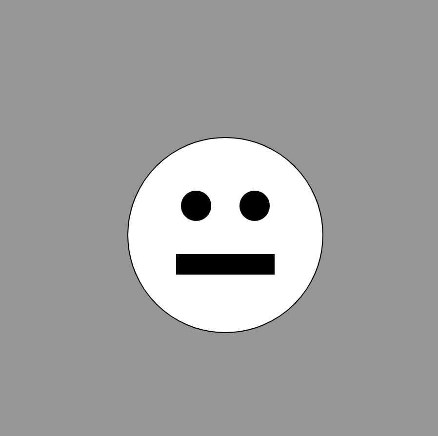

# Variables  

We are going to practice using built-in and user created variables today! Variables are containers for information that can change.

Some variables are system variables like `mouseX`, `mouseY`, `height`, and `width`. These are variables tha are built into the system and can be accessed by the user when writing our programs. For example, to plot a shape at the middle of the screen we could say:

```javascript
// Plots a circle at half the width of the canvas and half the height of the canvas. This corresponds to the center of the canvas.
ellipse(width/2, height/2, 60);
```

We may also want to declare our own variable that can be used in the program. We use this using the keyword `var` and giving the variable a unique name. The example below plots 4 circles using a user create `yPos` variable:

```javascript
// Declare a variable ouside the function
var y = 70;

function draw() {
	// Use the variable inside the draw function
	ellipse(50, y, 25);
	ellipse(100, y, 25);
	ellipse(150, y, 25);
	ellipse(200, y, 25);
}
```

## Task: Draw a Face
**GOAL**: Draw a face similar to the one shown below. 
**REQUIREMENTS**: You should:
- Use only two variables (x and y) to place all shapes on the page. 
- **HINT**: Think about how to get the white circle on the page and then update x and y.


